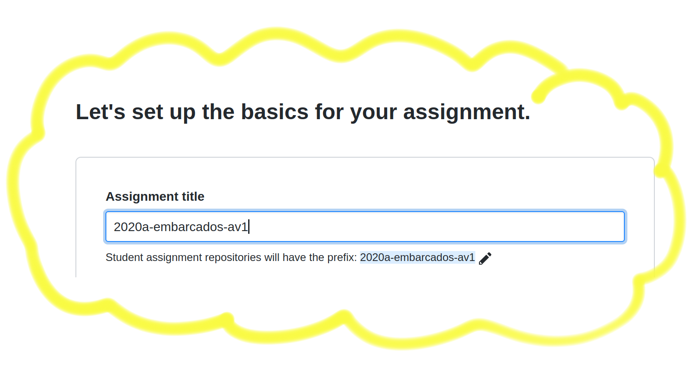

# Organização dedicada a avaliações Insper

Seguir o padrão para a criação das avaliações tanto para o repositório base da disciplina, quanto para os repositórios dos alunos!

**anoSemestre-disciplina-av**

Exemplo

- 2020a-robot-av2
- 2020a-ele-av3
- 2020a-embarcados-simulado-av1
- ...

Lembrar de colocar o mesmo nome na hora de criar a avaliação no classroom:

